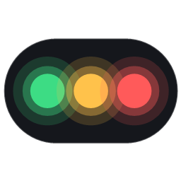
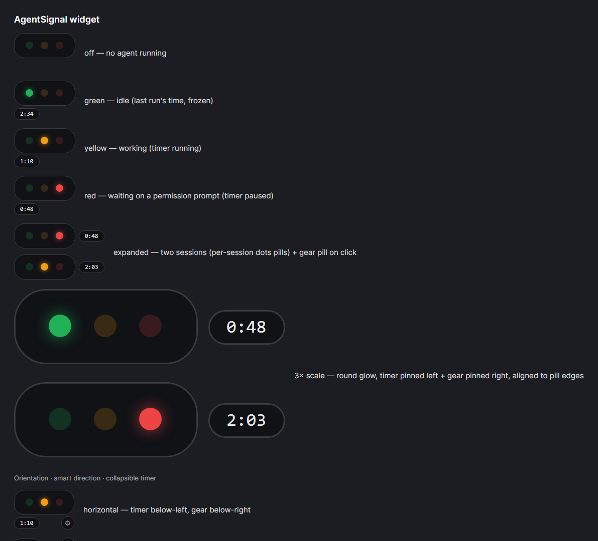
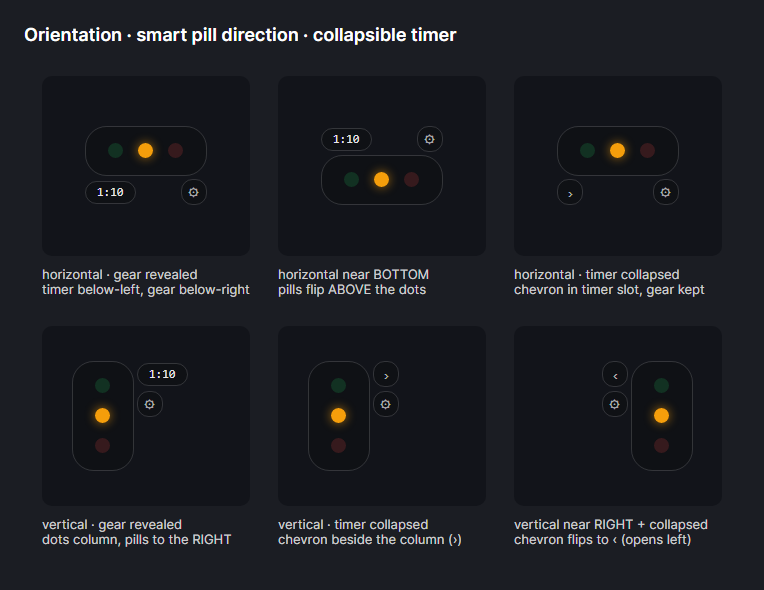

<p align="center">
  
</p>

<h1 align="center">AgentSignal</h1>

<p align="center">
  An always-on-top traffic light for your AI coding agents.<br/>
  <b>Green</b> = idle &nbsp;·&nbsp; <b>Yellow</b> = working &nbsp;·&nbsp; <b>Red</b> = waiting on you &nbsp;·&nbsp; plus a live work-time timer.
</p>

---

AI coding agents like **Claude Code** run long, unattended stretches — then silently block on a permission prompt while you're reading something in another window. AgentSignal is a tiny desktop widget that floats above everything and tells you at a glance what your agent is doing, so you never leave it stuck waiting (or interrupt it mid-run). When an agent needs permission, the light goes red and the widget can beep and toast; when a run finishes, it goes green and the timer freezes at the run's true working time.

<p align="center">
  
</p>

## Download (Windows)

**[⬇ Download the latest release](https://github.com/ZHC0912/AgentSignal/releases/latest/download/AgentSignal-win-x64.zip)** — `AgentSignal-win-x64.zip` (currently **v1.1.0**)

> **Note:** the newest features listed under [What's new](#whats-new-on-main-not-yet-released) are on `main` but **not in v1.1.0** — they'll land in the next release. To use them now, [build from source](#building-from-source).

The exes are fully self-contained (bundled .NET runtime): no .NET install, nothing on PATH. Unzip, then from the extracted folder:

```powershell
powershell -ExecutionPolicy Bypass -File install.ps1            # install + launch
powershell -ExecutionPolicy Bypass -File install.ps1 -Startup   # …and start on logon
```

The installer copies the app to a stable path (`%LOCALAPPDATA%\AgentSignal`), deploys the hook writer to `~/.agentsignal`, and merges the Claude Code hooks into your user-level `~/.claude/settings.json` (append-only and idempotent — your existing hooks are untouched). Open a Claude Code session and the dots light up.

Prefer just trying the widget? Grab the bare [`AgentSignal.exe`](https://github.com/ZHC0912/AgentSignal/releases/latest/download/AgentSignal.exe) and run it — you'll still need `install.ps1` (or `AgentSignal.Writer.exe install claude`) once so the agent can report its state.

## What's new (on `main`, not yet released)

These are in the code on `main` and will ship in the next release; the v1.1.0 download doesn't include them yet.

- **Session labels** — every pill now says which project it belongs to: the folder's and the agent's initials at rest (`A · C`), expanding in place to the full `AgentSignal · Claude` when you hover. The label can never nudge the dots, timer or gear.
- **Hide a session** — right-click any pill → *Hide this session*. It stays tracked underneath (its timer keeps running), but it no longer lights the widget or triggers alerts. The hide applies to that exact session only; a new session in the same folder shows up normally.
- **Settings → Session Tracking** — a live list of every tracked session with a show/hide checkbox each; tick one to bring a hidden pill back.
- **No more ghost pills** — dead sessions used to leave their files behind, and after a reboot Windows can hand a dead session's process ID to an unrelated program, which made the old session show up again as a stale pill. Sessions are now matched by process ID *and* process start time, and dead session files are cleared at startup and on every poll.

## What it does

- **Live state, per session** — green / yellow / red dots driven by the agent's real lifecycle events, never by guesswork or timeouts. Multiple concurrent sessions each get their own row (auto-expands at 2+), with the aggregate pill showing the most urgent state (red > yellow > green).
- **A truthful work timer** — counts *active* work only: it runs while the agent works, pauses while a permission prompt waits on you, back-credits approved tool time, and freezes at the run's total when the agent finishes. Waiting two minutes to click "allow" doesn't inflate a 1:10 run into 3:10.
- **Know which session is which** *(on `main`)* — each pill is labelled with its project folder and agent (`folder · Tool`), shown as initials and expanding to the full name on hover.
- **Hide what you don't need** *(on `main`)* — right-click to hide a single session's pill; Settings → Session Tracking lists every session with a show/hide checkbox.
- **Alerts** — optional sound + toast when an agent goes red (needs you) or green (finished).
- **Stays out of the way** — frameless, translucent, draggable, remembers its position, horizontal or vertical, scalable 0.6–3×, opacity control, lock-position, collapsible timer, launch-on-startup.
- **Manual reset** — <kbd>Ctrl</kbd>+<kbd>Alt</kbd>+<kbd>R</kbd> (or a Settings button) forces all sessions green, for the one case no hook covers: aborting a run with <kbd>Esc</kbd> fires no event, so the light can't clear itself.

<p align="center">
  
</p>

## How it works

AgentSignal is **adapter-based** — the widget knows nothing about any particular agent. Each supported agent gets a small adapter that translates its lifecycle events into a shared state contract; the same seam is designed to take Codex and others without touching the widget.

**Supported agents:**

- **Claude Code** (adapter #1) — full green/yellow/red lifecycle from its hooks.
- **Google Antigravity** (adapter #2, **IDE only** — the CLI is unverified) — yellow from tool hooks + live polling of the IDE's conversation db; **red at approval prompts ends the instant you approve** (cleaner than hooks allow on Claude). Honest limits: the pill only lights once Antigravity actually does tool work (an idle/never-used conversation shows nothing — the IDE's turn-level hooks don't fire in current builds), and green settles **~5s after** a turn ends (quiescence debounce, since no end-of-turn event runs). Details in [`adapters/antigravity/`](adapters/antigravity/).

```
AGENT (Claude Code)
   │  lifecycle hooks (SessionStart, UserPromptSubmit, PreToolUse, …)
   ▼
AgentSignal.Writer  ──  a tiny self-contained exe the hooks invoke
   │  writes one JSON file per live session
   ▼
~/.agentsignal/sessions/<tool>__<session_id>.json      ← the state contract
   │  polled every 250 ms
   ▼
AgentSignal.App  ──  the Avalonia widget: dots, timers, alerts
```

The hooks only ever report a state word (`green` / `yellow` / `red` / `off`); all timing logic lives in the widget, derived from state transitions. Session liveness is real: a session disappears when it ends *or* its process dies (PID captured at session start) — never on an inactivity timeout, so a healthy idle agent stays green forever. On `main`, a session is also matched to its process by start time, so a recycled process ID can't bring a dead session back, and dead session files are deleted rather than left behind.

Full documentation: **[architecture & behaviour](docs/architecture.md)** · **[Claude Code hook events (verified)](docs/claude-hook-events.md)**

| State | Meaning | Timer |
|---|---|---|
| 🟢 green | idle / run finished | frozen at the last run's time |
| 🟡 yellow | working | running |
| 🔴 red | waiting on a permission prompt | paused |
| ⚫ off | no agent running | hidden |

## Building from source

Requires the **.NET 10 SDK**. The widget and writer are plain .NET projects (Avalonia UI, MVVM):

```powershell
git clone https://github.com/ZHC0912/AgentSignal.git
cd AgentSignal
dotnet build AgentSignal.slnx
dotnet run --project src/AgentSignal.App          # run the widget from the dev tree

# self-contained single-file publish (what the release ships):
dotnet publish src/AgentSignal.App    -c Release -r win-x64 --self-contained true -p:PublishSingleFile=true -p:IncludeNativeLibrariesForSelfExtract=true -p:EnableCompressionInSingleFile=true
dotnet publish src/AgentSignal.Writer -c Release -r win-x64 --self-contained true -p:PublishSingleFile=true -p:EnableCompressionInSingleFile=true -p:PublishTrimmed=true
```

Layout: `src/AgentSignal.Core` (state contract, paths, process liveness) · `src/AgentSignal.Writer` (hook-invoked writer + `install claude`) · `src/AgentSignal.App` (Avalonia widget) · `adapters/claude` (hook mapping + the Phase 0 event-order findings).

The app ships with headless diagnostics — `--timer-test`, `--anchor-test`, `--reset-test`, `--blink-test`, `--label-test`, `--liveness-test`, `--screenshot <png>`, `--dump` (read-only; shows why each session file is live or stale), `--watch` — that prove the timer math, layout stability, reset, labelling/hiding and stale-session cleanup without a display. The design and its verified underpinnings are documented in [`docs/`](docs/README.md).

## Platform notes

Windows is fully supported and shipped. The codebase is cross-platform (Avalonia; per-OS features like startup, sound and the global hotkey sit behind interfaces) — Linux packaging is next, macOS when signing hardware is available.

## Roadmap

- 📱 **Phone notifications** (via [ntfy](https://ntfy.sh)) — get the red "agent needs you" alert on your phone when you step away.
- 🤖 **Codex adapter** — same hook vocabulary, same writer; the seam is already in place.
- 🐧 **Linux packaging** (and startup/sound/hotkey implementations behind the existing interfaces).

## License

[MIT](LICENSE)
